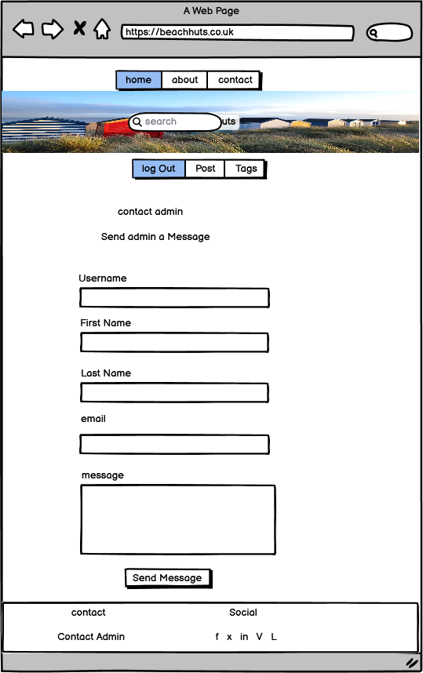
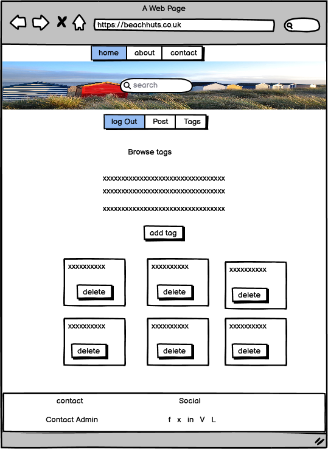
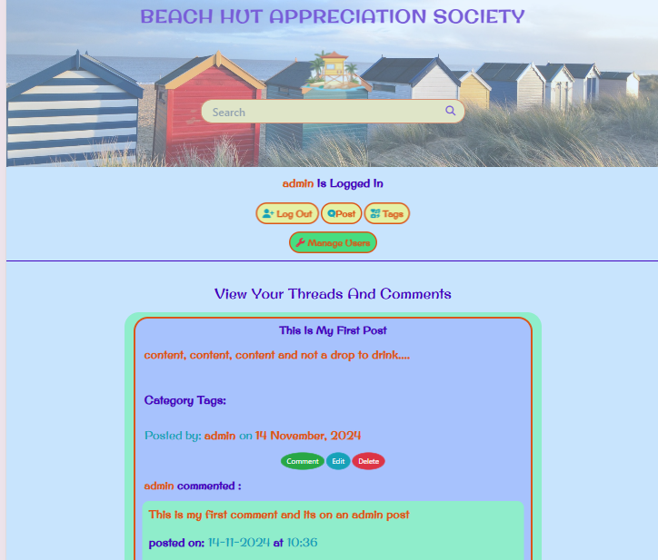
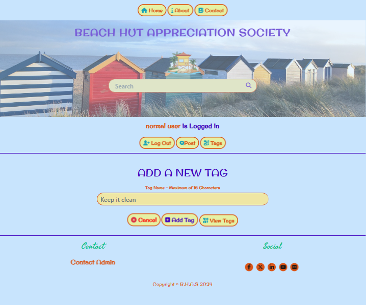

# My Beach Hut Appreciation Society Website


**Author Neil Allen**

## Beach Hut Appreciation Society

This is my website. It's a bit of fun to demonstrate capability in CRUD functionality. It's a website forum for beach hut aficianados and utilises Bootstrap and Flask and a Postgres Sql Dtabase. Written in HTML, CSS and Python following a common approach to data structures upporting similar applications. 

[View the live project here.](https://beach-hut-appreciation-society-0c8700c133d2.herokuapp.com/)

# Table of Contents

1. [Project Inception and Planning](#project-inception-and-planning)
2. [User Experience (UX)](#user-experience-ux)
    *   [User stories](#user-stories)
        *   [First Time Visitor Goals](#first-time-visitor-goals)
        *   [Returning Visitor Goals](#returning-visitor-goals)
        *   [Frequent User Goals](#frequent-user-goals)
    *   [Design](#design)
        *   [Colour Scheme](#colour-scheme)
        *   [Typography](#typography)
        *   [Imagery](#imagery)
        *  [Design Considerations](#design-considerations)
    *   [Database Design](#database-design)
        *   [Table Struture](#table-structure)
        *   [Diagram](#diagram)
    *   [Wireframes](#wireframes)
        *   [Base Template](#base)
        *   [Home](#home)
            *   [Logged In](#logged-in)
            *   [Logged Out](#logged-out)
        *   [Sign Up](#sign-up)
        *   [Log In](#log-in)
        *   [About](#about)
        *   [Contact](#contact)
        *   [Edit Profile](#edit-profile)
        *   [Edit Profile - Admin](#edit-profile---admin)
        *   [View All posts](#view-all-posts-for-user)
        *   [Posts](#posts)
            *   [Create Post](#create-a-new-post)
            *   [Edit Post](#edit-post)
            *   [Delete Post](#delete-post)
        *   [Comments](#comments)
            *   [Add Comment](#add-comment)
            *   [Edit Comment](#edit-comment)
            *   [Delete Comment](#delete-comment)
        *   [Tags](#tags)
            *   [Add Tag](#add-tag)
            *   [Delete Tag](#delete-tag)
        *   [Manage Users](#manage-users)
        *   [Search Results](#search-results)
    *   [Structure](#structure)
3. [Features](#features)
4. [Pages](#pages)
    *   [Landing Page](#landing-page)
        *   [Menu Bar](#menu-bar)
        *   [Floating Anchor](#floating-anchor)
    *   [Sign Up Page](#sign-up-page)
    *   [Log in Page](#log-in-page)
    *   [About Page](#about-page)
    *   [Edit Profile Page](#edit-profile-page)
    *   [Edit Profile - Admin Page](#edit-profile---admin-page)
    *   [View All Posts Page](#view-all-posts-page)
    *   [Post Pages](#posts-pages)
        *   [Create Post](#create-post-page)
        *   [Edit Post](#edit-post-page)
        *   [Delete Post](#delete-post-page)
    *   [Comments Pages](#comments-pages)
        *   [Create Post](#create-comment-page)
        *   [Edit Post](#edit-comment-page)
        *   [Delete Post](#delete-comment-page)
    *   [Tag Pages](#tag-pages)
        *   [Create Tag](#create-tag-page)
        *   [Delete Tag](#delete-tag-page)
    *   [Manage Users](#manage-users-page)
    *   [Search Results](#search-results-page)
    *   [Contact Page](#contact-page)
    *   [Flash Messages](#flash-messages)
    *   [Site Features](#site-features)
5. [Technologies Used](#technologies-used)
    *   [Development Environment](#development-environment)
    *   [Languages Used](#languages-used)
    *   [Frameworks, Libraries & Programs Used](#frameworks-libraries--programs-used)
6. [Testing](#testing)
    *   [HTML](#html)
    *   [CSS](#css)
    *   [JavaSceipt](#javascript)
    *   [Testing User Stories from User Experience (UX) Section](#testing-user-stories-from-user-experience-ux-section)
        *   [First Time Visitor Goals](#first-time-visitor-goals-1)
        *   [Returning Visitor Goals](#returning-visitor-goals-1)
        *   [Frequent User Goals](#frequent-user-goals-1)
    *   [Responsiveness](#responsiveness)
    *   [Accessibility](#accessibility)
    *   [Screen Reader](#screen-reader)
    *   [Lighthouse Testing](#lighthouse-testing)
    *   [Functional Testing](#functional-testing)
        *   [Navigation Links](#navigation-links)
        *   [Testing](#testing-approach)
        *   [Sign Up](#sign-up-testing)
        *   [Log In](#log-in-testing)
        *   [Thread Post](#thread-post-testing)
        *   [Comments](#comments-testing)
        *   [Tags](#tags-testing)
        *   [Manage Users](#manage-users-testing)
        *   [Search Function](#search-function-testing)
        *   [Contact](#contact-testing)   
        *   [Links Testing](#links-testing)
        *   [Footer Contact Information](#footer-contact-information)
    *   [Further Testing](#further-testing)
    *   [Bugs and Fixes](#bugs-and-fixes)
    *   [Known Bugs](#known-bugs)
    *   [Future Releases](#future-releases)
7. [Deployment](#deployment)
    *   [Version control](#version-control)
    *   [Github Pages](#github-pages)
    *   [Deployments to Github Pages](#deployment-to-github-pages)
    *   [Clone the repository locally](#clone-the-repository-code-locally)
    *   [Heroku](#heroku)
    *   [App Deployment](#app-deployment-to-heroku)
8. [Credits](#credits)
    *   [Code](#code)
    *   [Content](#content)
    *   [Media](#media)
    *   [Acknowledgements](#acknowledgements)

## Project Inception and Planning

## User Experience (UX)

-   ### User stories

    -   #### First Time Visitor Goals

        1. As a First Time Visitor, .
        2. As a First Time Visitor, 
        3. As a First Time Visitor, 

    -   #### Returning Visitor Goals

        1. As a Returning Visitor,
        2. As a Returning Visitor, 
        3. As a Returning Visitor, 
    -   #### Frequent User Goals
        1. As a Frequent User, 
        2. As a Frequent User, 
        3. As a Frequent User, 

-   ### Design
    -   #### Colour Scheme
        -   I've used the pastel beach themed colours to reflect the subject matter of the site. A pale blue (#C8E4FD) background for the body.
        Titles alternatively in Dark Blue (#4203BF) and Sand (#DA5619) with text in Light Blue and Sand. Buttons are consistent according to function.
        -   General navigation buttons are similarly styled and edit, comment and delete buttons are styled differently to differentiate but remain consistnet amongst the forum post and tag elements.
        -   Some colours were muted or changed to meet WAVE guidelines during final stage testing. 
        
    -   #### Typography
        -   The fonts chosen are Original Surfer and Seaweed Script to adhere to teh beach theme. Seaweed Script is novel but unsuitable for use in large text blocks as it can make it difficult to read. Sans-serif is the fallback font.
 
    -   #### Imagery
        -   There is a Hero image in teh base template which propogates to each page and gives the site a consistenmt look and feel.
        -   There is a beach logo on larger screens but is hidden below 1000px.
        -   The site has a couple of additional images on the About page but as a blog site is mostly text based, for now..

    -   #### Design Considerations
        -   The site is built with templates based on Base.html so retains a consistent Header and Footer
     
        -   Colours are Bold yet soft and are selected to communicate a fun, beach theme and reflect the varied colours that are common to beach hut installations.

        -   The header and footer occupy the whole width of teh screen but contnet has wide margins on larger screen sizes with thin margins for tablet and mobile views.

        -   The site is responsive with menus and text resized for smaller screens. 

        -   Menu navigation is consistent across all pages and screen sizes and is central to each page. Menus change according to login and admin status.

        -   Menu button text is Sand witha  yellow background. The admin only function is highlighted in Green.

        -   There is a customised error-404 page 'just in case'.

        -   There are popup confirmations on all Delete functions and each update page also offers a 'cancel' function rather than expecting teh user to use tha back button or actively click elsewhere.

        -   Administrators have additional functions which are presented when they access different ares of the site.

        -   Error and confirmation messages are displayed at the top of the main site area, below the secondary menus. I chose not to make these disappear automatically or after a stated time as I personally find that inconvenient and prefer to have messages displayed until i have read that at my pace and taken action to dismiss them.
        
        -   Threads(posts) and the first comment are visible to all visitors but user have to register and login to see full posts or comment.

        -   Logged in users get to see their user profile, can edit it and can see all their own posts on a 'view all posts' page. I chose not to allow users to delete their own accounts as that would remove contnet from the site, incluidng any responses from other users. 

-   ### Database Design
-   #### Table Structure


-   #### Diagram
    <details><summary>Base Template</summary>
    
    </details>

-   ### Wireframes

-   #### Base
    <details><summary>Base Template</summary>
    
    </details>

-   #### Home
-   ##### Logged In
    <details><summary>Home - Logged In</summary>
    
    </details>

-   ##### Logged Out
    <details><summary>Home - Logged Out</summary>
    
    </details>
    
-   #### Sign Up
    <details><summary>Sign Up</summary>
    
    </details>

-   #### Log In
    <details><summary>Log In</summary>
    
    </details>

-   #### About
    <details><summary>About</summary>
    
    </details>

-   #### Contact
    <details><summary>Contact</summary>
    
    </details>

-   #### Edit Profile
    <details><summary>Edit profile</summary>
    
    </details>

-   #### Edit Profile - Admin
    <details><summary>Edit profile, Administrator</summary>
    
    </details>

-   #### View All Posts For User
    <details><summary>View All posts For A User</summary>
    
    </details>

-   #### Posts
-   ##### Create A New Post
    <details><summary>Create A New Post</summary>
    
    </details>

-   ##### Edit Post
    <details><summary>Edit post</summary>
    
    </details>

-   ##### Delete Post
    <details><summary>Delete post</summary>
    
    </details>

-   #### Comments
-   ##### Add Comment
    <details><summary>Add Comment</summary>
    
    </details>

-   #### Edit Comment
    <details><summary>Edit Comment</summary>
    
    </details>

-   #### Delete Comment
    <details><summary>Delete Comment</summary>
    
    </details>

-   #### Tags
-   ##### Add tag
    <details><summary>Add Tag</summary>
    
    </details>

-   ##### Delete Tag
    <details><summary>Delete Tag</summary>
    
    </details>

-   #### Manage Users
    <details><summary>Manage Users</summary>
    
    </details>

-   #### Search Results 
    <details><summary>Search Results</summary>
    
    </details>
 
-   ### **Structure**

    The structure of the site is informed by the the target audience's expectations and the principles of IXD (interaction design) to make sure I was making everything as intuitive as I could. Each page has a clear function and is named to give a clear indication of content/function.

    Visitors can view some site content but to add or view full content, visitors are required to sign up and login.

    Functions serve:
    -   Sign Up
    -   Login and out
    -   Thread(Post) full view, creation, edit, deletion
    -   Comment creation, edit and deletion
    -   Category tag creation and deletion
    -   An About Page
    -   Admin functions to manage Users and edit/delete all elements
    -   User profile editing
    -   Email contact/feedback Form
    -   Search facility

    The site is templated and built around a Base Html file containing a consistent Header and Footer:

    The site has a navbar which remains central to the screen on desktop, tablet and mobile.

    A second menu bar is presented according to logged in/logged out status. Administrators are presented with an additional 'Manage Users' button.
    
    There is also a footer on every page with links to social media sites and the Contact page.

    The Hero image is consistent across all pages and there is a search bar. There is a small loogo on larger screens but hidden at smaller resolutions.
    
    Each page has a scrolling 'top of page' anchor link.

    Social media links all point to beach hut specific sites if they exist and standard social channels if not. 
    
## Features

-   Responsive on all device sizes down to 280px - the industry standard minimum screen width.

## Pages
### Landing Page
-   Landing page image   
    *   The first page is the index or home page.
    *   For visitors, this shows a list of forum posts sorted with most recent first.
    *   For users, this shows the user profile summary plus the list of Forum posts.
    *   This will help to immediately show the visitor/user what the website is about. 
    <details><summary>Landing Page - Visitor</summary>
    
    </details>
    <details><summary>Landing Page - User</summary>
    
    </details>

-   #### Menu Bar
    <details><summary>Navigation Menu</summary>
    
    </details>
    
-   #### Floating Anchor
    Each page also has a floating anchor link at the side to take the user back to the top of the page. 
    <details><summary>Bottom links</summary>
    
    </details>
    
    <details><summary>Anchor link to Top</summary>
    
    </details>
    
-   #### Sign Up Page
    Visitor can become a member by registering by email address and selecting a username and password.
    <details><summary>Sign Up Page</summary>
    
    </details>

-   ####  Log In Page
    <details><summary>Log In Page</summary>
    
    </details>

-   #### About Page
    <details><summary>AboutPage</summary>
    
    </details>

-   #### Edit profile Page  
    <details><summary>Edit Profile Page</summary>
    
    </details>

-   ####  Edit profile - Admin Page
    <details><summary>Edit Profile - Admin Page</summary>
    
    </details>

-   #### View All Posts Page  
    <details><summary>View All Posts Page</summary>
    
    </details>

-   #### View Full Posts Page  
    <details><summary>View Full Posts Page</summary>
    
    </details>

### Posts Pages
-   #### Create Post Page
    <details><summary>Create Post Page</summary>
    
    </details>

-   #### Edit Post Page
    <details><summary>Edit Post Page</summary>
    
    </details>

-   #### Delete Post Page
    <details><summary>Delete Post Page</summary>
    
    </details>

### Comments Pages
-   #### Create Comment Page
    <details><summary>Add Comment Page</summary>
    
    </details>

-   #### Edit Comment Page
    <details><summary>Edit Comment Page</summary>
    
    </details>

-   #### Delete Comment Page
    <details><summary>Delete Comment Page</summary>
    
    </details>

### Tag Pages
-   #### Create Tag Page
    <details><summary>Add Tag Page</summary>
    
    </details>

-   #### Delete Tag Page
    Admin only function. Button Hidden for normal users.
    <details><summary>Delete Tag Page</summary>
    
    </details>

### Manage Users Page
* Admin only function. Menu Button Hidden for normal users.
    <details><summary>Manage Users Page</summary>
    
    </details>

-   #### Search Results Page
    <details><summary>Search Page</summary>
    
    </details>

### Contact Page 
* A contact is offered to allow users to contact me. The form consists of the following fields and attributes: 
        - First Name (required, type=text).
        - Last Name (required, type=text).
        - Email (required, type=email).
        - Message (required, type=textarea), maximum 280 characters.
        - Muted Text is used as hints or for assurance on certain fields. This has been adjusted for WCAG compliance.
    * This allows a user to contact admin with any queries.
    * A flash message indicates success or failure of the message send.
    <details><summary>Contact Page</summary>
    
    </details>

### Flash Messages
* Flash messages are displayed below the secondary menu bar to notify errors or when a particular creation or edit action has been successful
    <details><summary>Flash Message Example</summary>
    
    </details>

### Site Features

* Responsive design - content scales from 280px to Large Desktop. Some content is hidden at smaller resolutions to maintain user experience.
* Top Menu navbar remains consistent with a secondary Menu bar that responds to user status.
* There is a Top of the Page scrolling button on each page. 
* The main landing page contains a list of posts sorted with most recent first.
* There is an about page to provide more information about the site and the topic 
* Contact form.
* Search facility.
* Sign Up and login functionality.
* Access to Create, Edit and Delete of site elements are controlled by user status and permissions.
* There are links to social media.
* The site is clean and uncluttered and follows a Beach theme.

## Technologies Used

### Development Environment
-   The site was developed in a [Gitpod](https://www.gitpod.io/) environment using VSC.

### Languages Used

-   [HTML5](https://en.wikipedia.org/wiki/HTML5)
-   [CSS3](https://en.wikipedia.org/wiki/Cascading_Style_Sheets)
-   [JavaScript](https://en.wikipedia.org/wiki/JavaScript)
-   [Python](https://docs.python.org/3/)


### Frameworks, Libraries & Programs Used

1. [Bootstrap 4.2.1:](https://getbootstrap.com/docs/4.6.2/getting-started/introduction/)
    - Bootstrap was used to assist with the responsiveness and styling of the website.
1. [Hover.css:](https://ianlunn.github.io/Hover/)
    - Hover.css was used on the Menu items in the navbar as well as the Social Media icons in the footer to add the 'grow' transition while being hovered over.
1. [Google Fonts:](https://fonts.google.com/)
    - Google fonts were used to import the 'Baskerville Libre' and 'Open Sans' fonts into the style.css file which is used on all pages throughout the project.
1. [Font Awesome:](https://fontawesome.com/)
    - Used for icons on social links and drop down menus.
1. [jQuery:](https://jquery.com/)
    - jQuery is used to make the navbar responsive and provide additional coding flexibility. specifically used with the emailJS service, modal and other processing.
1. [Select2:](https://select2.org/)
   - Select2 was used for styling the dropdown to allow multiple selections without CMD/CTRL or Shift.
1. [Gitpod](https://www.gitpod.io/)
   - GitPod was used for version control by utilizing the GitPod terminal to commit to Git and Push to GitHub.
1. [GitHub:](https://github.com/)
   - GitHub is used to store the project's code after being pushed from the development environment.
1. [Balsamiq:](https://balsamiq.com/)
   - Balsamiq was used to create the [wireframes](#wireframes) during the design process.
1. [Jest:](https://jestjs.io/)
   - Jest was used to test the Javascript used.
1. [SQLAlchemy:](https://docs.sqlalchemy.org/en/20/)
   - SQLAlchemy was used to communicate between the database and the frontend
1. [DBDiagram:](dbdiagram.io)
   - Used to document database model.
1. [FLASK:](https://flask.palletsprojects.com/)
   - Flask Frameworking was used to structure the site including the use of Jinja2 templating. Allowed for the smooth display of data from the backend. 
1. [StackOverflow:](https://stackoverflow.com/)
    - Used for code snippets and tutorials. Invaluable.

## Testing

The W3C Markup Validator and W3C CSS Validator Services were used to validate every page of the website to ensure there were no syntax errors in the project.

### HTML

This was carried out periodically as each page was created and amended and then finally checked again when pages were deemed complete and error free.

-   [W3C Markup Validator](https://validator.w3.org/#validate_by_input)

    <details><summary>Home Page</summary>
    
    </details>
    <br>
    <details><summary> Page</summary>
    
    </details>
    <br>
    <details><summary> Page</summary>
    
    </details>
    <br>
    <details><summary> Page</summary>
    
    </details>
    
### CSS

This was checked periodically as each page was created and CSS code added and amended. A final check was carried out when all other testing had been satisfactorily completed.

-   [W3C CSS Validator](https://jigsaw.w3.org/css-validator/#validate_by_input)

    <details><summary>style.css</summary>
    
    </details>
    <br>

### JavaScript

This was checked periodically as each page was created and CSS code added and amended. A final check was carried out when all other testing had been satisfactorily completed.

-   [jshint JavaScript Validator](https://jshint.com/)

    <details><summary>Main JS - scripts.js</summary>
    
    </details>
    <br>   

### Testing User Stories from User Experience (UX) Section

-   #### First Time Visitor Goals

    
    1. As a First Time Visitor,
        
        1. 
        2. 

    2. As a First Time Visitor, 

        1. 
        2. 
        3.

    3. As a First Time Visitor,
       
        1. 
        2. 
        3. 
-   #### Returning Visitor Goals

    1. As a Returning Visitor,
       
        1. . 
        2. 
        3. 

    3. As a Returning Visitor, 

        1. Each page footer has a clear link to the comments and feedback page to send a message.
        2. Each page menu bar has a link to the comments and feedback page where a user can submit a request for more information.

    4. As a Returning Visitor,
       
        1. 

-   #### Frequent User Goals

    1. As a Frequent User,
        
        1. 
        2. 

    3. As a Frequent User,
        
        1. 
        2. 

    5. As a Frequent User, 

        1. 
        2. 
        
### Responsiveness

All pages were tested to ensure responsiveness on screen sizes from 280px and upwards as defined in [WCAG 2.1 Reflow criteria for responsive design](https://www.w3.org/WAI/WCAG21/Understanding/reflow.html) on the following browsers:
- Chrome    (123.0.6312.106).
- Edge      (123.0.2420.81).
- Firefox   (124.0.2).
- Safari    (17.4).
- Opera     (109.0.5097.24).

Steps to test:

1. Open browser and navigate to
[vvvvvvvvvvvvvvvvvvvvvvvvvvvvvvvvvvv).
2. Open the developer tools (right click and inspect).
3. Set to responsive and decrease width in stages to 280px.
4. Set the zoom to 50%.
5. Click and drag the responsive window to maximum width, noting transitions at breakpoints.
6. Rotate and test for portrait to landscape transition.

Results:

Website is responsive on all screen sizes and no images are pixelated or stretched.
No horizontal scroll is present.
No elements overlap.
Text resizes as expected at breakpoints.
Some content is hidden where it would clutter smaller screens.

Website was also opened on the following devices and no responsive issues were seen:

- iPhone X, 12, 14.
- Apple iPad 12.9.
- Fujitsu 15.4in laptop.
- Hp 22in desktop.

### Accessibility

[Wave Accessibility](https://wave.webaim.org/) tool was used throughout development
and for final testing of the deployed website to check for any aid accessibility testing.

Testing was focused to ensure the following criteria were met:

- All forms have associated labels or aria-labels so that this is read out on a screen reader to users who tab to form inputs.

- Color contrasts meet a minimum ratio as specified in
  [WCAG 2.1 Contrast Guidelines](https://www.w3.org/WAI/WCAG21/Understanding/contrast-minimum.html).    

- Heading levels are not missed or skipped to ensure the importance of content is relayed correctly to the end user.

- All content is contained within landmarks to ensure ease of use for assistive technology, allowing the user to navigate by page regions.

- All non-textual content has alternative text or titles so descriptions are read out to screen readers.

- HTML page lang attribute has been set.

- Aria properties have been implemented correctly.

- WCAG 2.1 Coding best practices being followed.

- Hyperlink text colour has been adjusted to adhere to contrast guidelines.

Results:

<details><summary>Home Page</summary>

</details>
<br>

<br>
<details><summary> Page</summary>

</details>
<br>
<details><summary> Page</summary>

</details>
<br>


Manual tests were also performed to ensure the website was as accessible as possible.

### Screen Reader

Screen reader testing was performed using NVDA software from [NV Access](https://www.nvaccess.org/).
This confirmed that:

-   All text is readable.
-   All images have accurate, useful text descriptions.

### Lighthouse Testing

<details><summary>Home Page</summary>

</details>
<br> 
<details><summary> Page</summary>

</details>
<br>
<details><summary> Page</summary>

</details>
<br>
<details><summary>Contact Page</summary>

</details>
<br>

### Functional Testing

- #### Navigation Links

Testing was performed to ensure all navigation links on the respective pages, navigated to the correct pages as per design.

This was done by clicking on the navigation links on each page on a desktop, laptop, tablet and mobile device.

Additionally, Adminstrator and basic user accounts were created to check that correct menu options were presented and enhanced functionality restricted to Administrator privileged accounts. 

Links on all pages navigated to the correct pages as expeccted. External content opens in a new page.

-   ####  Testing Approach

-   #### Sign Up Testing


-   #### Log In Testing


-   #### Thread Post Testing

-   #### Comments Testing

-   #### Tags Testing

-   #### Manage Users Testing

-   #### Search Function Testing

-   #### Contact Testing

Testing was performed to ensure that 

The form on the contact page was tested to ensure it functioned as expected when correct and incorrect data was input.

Specifically:

-   Missing one or more input field:
    An error was highlighted to the user and the form could not be submitted.

-   Incorrect email format:
    An error was highlighted to the user and the form could not be submitted.
    
-   Form completed correctly with valid information in all fields:
    The form is able to be submitted.

-   Form textarea will only accept a minimum of 1 and a maximum of 280 characters.

-   Succesful submission of the contacts/feedback form: A confirmation message is displayed. 

-   Incorrect submission was emulated by temporarily amending emailJS validation information to force an error. The "failed" confirmation message was displayed as expected and could be dismissed. 

- ### Links Testing

Testing was performed to:

-   Open each hyperlink on each page and check that it is a valid URL and opens in a new page.

-   Checked on desktop, tablet and mobile.

-   ### Footer Social Media Icons / Links

Testing was performed on the Font Awesome Social Media icons in the footer to ensure that each one opened in a new tab and that each one
had a 'grow' hover effect.

Each item opened a new tab when clicked as expected and correct hover effect was present.

-   ### Footer Contact Information

The 'go to' link reacts when hovered over.

### Further Testing

-   Testing was carried out as each function was developed. The menu structure, navigation and footer were tested until error free on base.html before other page fucntionality was developed.
-   Code for creation, edit and delete was tested with Models that didnt update the database to check processing functionality before data chnages were attempted.
-   Admin and normal user accounts were created to support testing of restricted/enhanced permissions.
-   As each page was completed, existing succesful tests were rerun to ensure that proven functionality hadn't been affected. 
-   The Website was tested on Google Chrome, Internet Explorer, Microsoft Edge and Safari browsers.
-   The website was viewed on a variety of devices such as Desktop, Laptop, iPhone7/8/X and iPad.
-   A large amount of testing was done to ensure that all pages were linking correctly.
-   Friends and family members were asked to review the site and documentation to point out any bugs and/or user experience issues.


### Bugs and Fixes

-   db_create would not work as advised on this version of python. I obtained the correct syntax from a web forum.
-   Model changes would not propogate to Heroku despite Databse recreation. This was solved by creating a new Sql hosting instance and updating Heroku config.
-   Permissions not being applie dto admin accounts caused by an errant 'div'.
-   Search bar woudlnt line up with icon. Margins and padding on standard bootstrap settings overwritten by css changes. 
-    Posts and commnets not consistently displaying. Moved formatting to earlier in loop processing.
-   Comment processing causing Model error. Confusion over singular comment (db field) and comments (table name).
-   Password Model length too small for hashed value. Increased to 255, db created and changes propogated to Heroku.
-   Manage user passing current user value through (admin) rather than user to be edited. Return value in Manage-user Model changed from current_user.

-   WCAG contrast issues.
    - Fixed - Minor colour scheme changes.

### Known Bugs

- There are no known errors.  

### Future Releases
-   Ideas for future development could include:
    -   Enabling pictures to be added to posts.
    -   User password self reset.

## Deployment

### Version Control

The site was created using the Visual Studio code editor and pushed to the remote repository on GitHub: ‘beach_hut_society’.

The following git commands were used throughout development to push code to the remote repository:

```git add <file>``` 
    - This command was used to add the file(s) to the staging area before they are committed.

```git commit -m “commit message”```
    - This command was used to commit changes to the local repository queue ready for the final step.

```git push origin main``` 
    - This command was used to push all committed code to the remote repository on github.

### Clone the Repository Code Locally

- Navigate to the GitHub Repository you want to clone to use locally:

    - Click on the code drop down button.
    - Click on HTTPS.
    - Copy the repository link to the clipboard.
    - Open your IDE of choice (git must be installed for the next steps).
    - Type git clone copied-git-url into the IDE terminal.

The project will now have been cloned on your local machine for use.

### Heroku

The project was deployed to Heroku using the following steps:

### App Deployment to Heroku

- You will need to deploy the application using Heroku.

1. Create a requirements.txt file:
    -   Type ``` pip3 freeze --local > requirements.txt ``` in theGitpod CLI.
    -   This shoudl be added to the .gitignore file.
2. Create a Procfile:
    -    Type ```echo web: python app.py > Procfile```.
    -    Open it and remove any spurious lines. It should have a singular line and commence with a capital P.
3. Add and commit these files to Github.
4. Go to [Heroku](https://dashboard.heroku.com/apps). Log in or create an account
5. Click the 'New' button and click 'Create new app'.
6. Enter a unique name for your project with no capital letters or spaces and select your region. Click 'Create App'.
7. Inside your project, go to the Resources tab and create a Heroku Postgres Database
8. Inside your project, go to the 'Settings' tab. Scroll down and click 'Reveal Config Vars'.
9. Add in the following variables
  - IP : 0.0.0.0
  - PORT : 5000
  - DATABASE_URL : This is the location of your production database.
  - SECRET_KEY : Your secret key
10. Deploy your project by going to the Deploy tab and choose 'Connect to Github'
11. Find your repository name and select Connect.
12. To connect your Heroku database, go to 'More' in the top right:
  - Select run console.
  - Enter ```python3``` to access the python intepreter.
  - Enter:
    - ```From beachhut import app, db```
    - ```app.app-context().push()```
    - ```db.create_all()```
    - You can then exit the console with ```exit()```

## Credits

### Code

-   [Bootstrap4](https://getbootstrap.com/docs/4.4/getting-started/introduction/): Bootstrap Library used throughout the project mainly to make site responsive using the Bootstrap Grid System.

. [jQuery:](https://jquery.com/):
    - jQuery is used to make the JavaScript code more succinct and simplify some processing.

### Content

-   All content was written by the developer with a great deal of assistance from youtube tutorials and stack overflow.

-   Mostly trial and errorand getting one function working an dthen replicating it.

-   Inspiration was taken from existing blog sites and sample projects suggested by my tutor:
    -   https://github.com/EmmaJane22/HappyCamper
    -   https://github.com/sdthomas91/chat-down-under-new
    -   https://github.com/szilvia-csernus/community-transport

### Media

-   Free background removal on various images using [photoroom](https://www.photoroom.com/tools/background-remover). 

-   The main background image is a standard Microsoft image. Other images are copyright free.

### Acknowledgements

-   My Mentor for his continuous helpful feedback and support.

-   Stackoverflow resources at their website and on Youtube.

-   The whole community of developers who freely advise and share their knowledge via blogs, videos and web comments.

-   Tutor support at Code Institute for his support.
